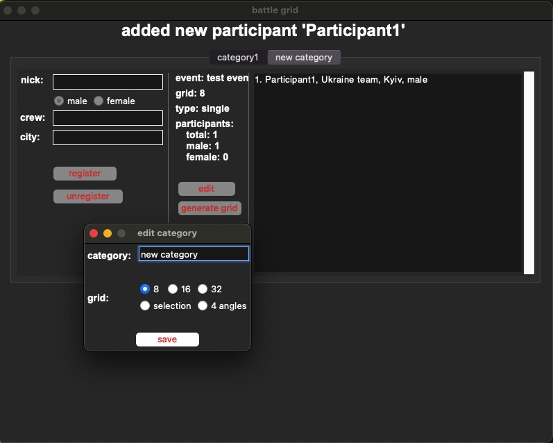
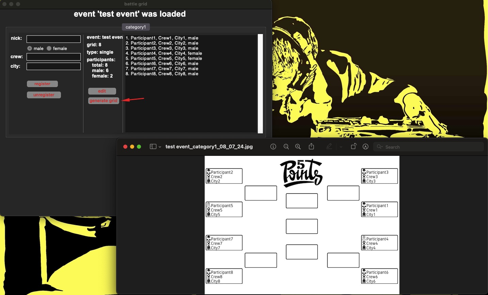
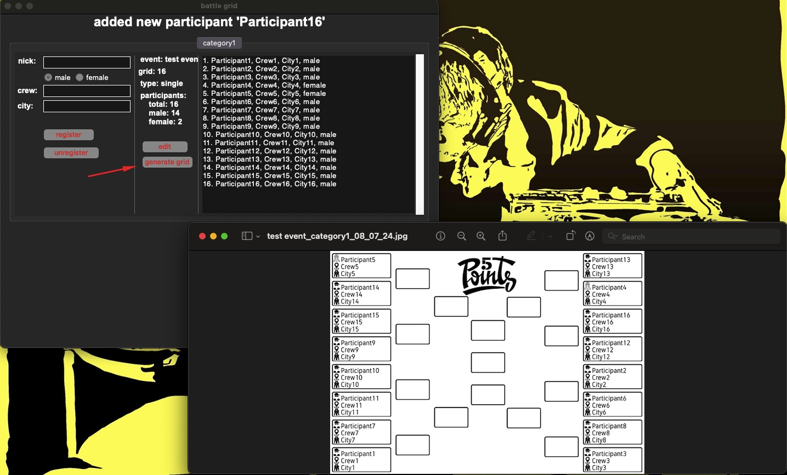
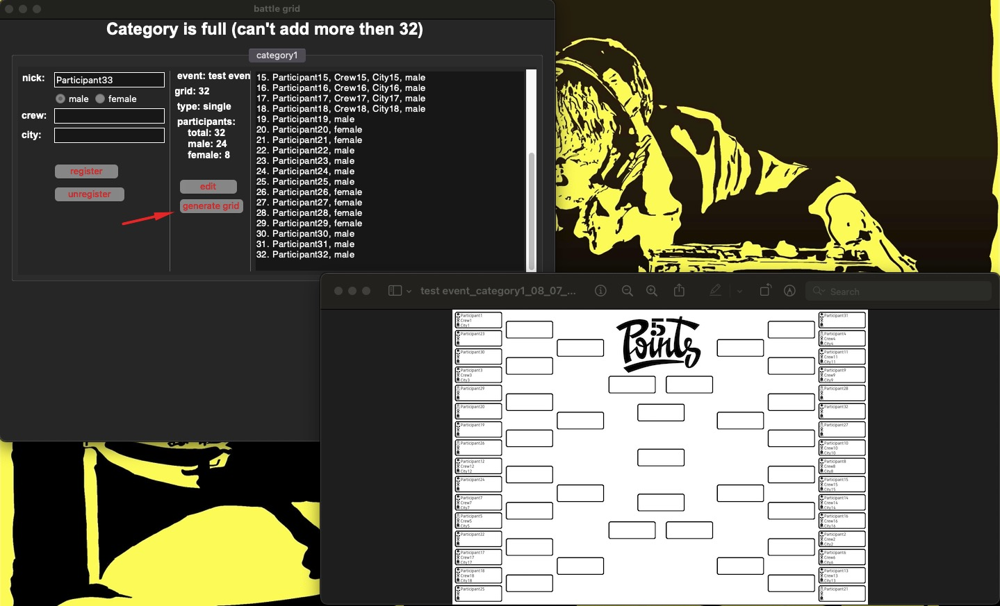

# Battle Grid

Battle Grid is a Python-based application that allows you to manage events, create categories, and generate competition grids for participants. The user interface is built using Tkinter, and the application uses the Pillow package to generate PNG files of competition grids. This project is designed to streamline the process of organizing and managing competitive events.

## Features

- **Create Events:** Set up new events and manage multiple events simultaneously.
- **Category Management:** Create categories within each event and specify the number of participants via radiobuttons (8, 16, 32).
- **Participant Management:** Add participants with details such as nickname, crew, and city.
- **Generate Grids:** Automatically generate competition grids for randomly mixed participants and save them as PNG files.
- **Directory Selection:** Choose the directory where the generated files will be saved. This path is cached for future use.
- **Data Persistence:** Save all event data in JSON format, allowing you to open, manage, and switch between events seamlessly.

## Installation

1. **Clone the repository:**
    ```sh
    git clone https://github.com/yourusername/battle-grid.git
    cd battle-grid
    ```

2. **Create and activate a virtual environment (optional but recommended):**
    ```sh
    python -m venv venv
    source venv/bin/activate  # On Windows, use `venv\Scripts\activate`
    ```

3. **Install the required dependencies:**
    ```sh
    pip install -r requirements.txt
    ```

## Usage

1. **Run the application:**
    ```sh
    python main.py
    ```

2. **Create an Event:**
    - Enter the event details and create categories.
    - Select the number of participants for each category (8, 16, 32) using the radiobuttons.
    
3. **Add Participants:**
    - Add participants with their nickname, crew, and city.

4. **Generate Grid:**
    - Click the `Generate Grid` button to create a competition grid.
    - The generated grid will be saved as a PNG file in the selected directory (can change in file -> Settings).

5. **Manage Events:**
    - Open, manage, and switch between events easily.
    - All event data is saved in JSON format for persistence.

## Example Screenshots

*Event "test event", category "category1" edit popup*


*Event "test event", category "category1", generated grid for 8 participants*


*Event "test event", category "category1", generated grid for 16 participants*


*Event "test event", category "category1", generated grid for 32 participants*


## Dependencies

- **Python 3.x**
- **Tkinter** (usually included with Python)
- **Pillow** for image processing
- **JSON** for data persistence
